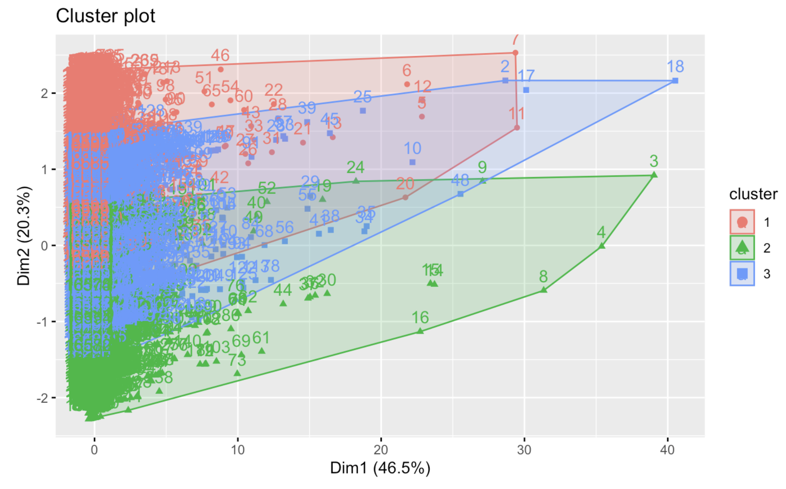

# Phase1:

# Proplem:

We live in a time when video games are extremely popular. The global video game market continues to grow year-on-year, and the industry is now valued at over \$100 billion worldwide. With technology continuously pushing the boundaries, video games have only become more popular and more high-quality. Gameplay mechanics, cutting-edge graphics, and intricate storylines make today's games more immersive than ever before. We chose this dataset to gain insights on the popularity of upcoming games.

# Class label:

Popular' is our class label, we will use Global_Sales attribute to predict whether a game will sell 1000000 or more globally.

# Data Mining Task:

Our data mining task is to predict the popularity of upcoming games using regression.

# Description of the dataset:

The dataset provided by vgchartz.com supply us with a valuable resource to explore the platforms and genres of the top 16599 global video games. Through it, we can analyze the most popular platforms and genres that are influencing global sales, and detectr how regions' sales affect global sales.

# Our goal:

Our goal from studying this dataset is to utilize regression techniques on the input data to make predictions about the popularity of upcoming games.

# Source and link:

Source: Kaggle

URL link: <https://www.kaggle.com/datasets/gregorut/videogamesales>

# Attributes description:

| **Attributes name** | **Description**                            | **Data type**          |
|------------------------|-----------------------------|-------------------|
| Rank                | Ranking of the game based on global sales. | Numeric                |
| Name                | Name of the game.                          | Nominal                |
| Platform            | Platform the game was released on.         | Nominal                |
| Year                | Year the game was released.                | Ordinal                |
| Genre               | Genre of the game                          | Nominal                |
| Publisher           | Publisher of the game.                     | Nominal                |
| NA_Sales            | Sales of the game in North America         | Numeric (ratio-scaled) |
| EU_Sales            | Sales of the game in Europe                | Numeric (ratio-scaled) |
| JP_Sales            | Sales of the game in Japan                 | Numeric (ratio-scaled) |
| Other_Sales         | Sales of the game in other regions         | Numeric (ratio-scaled) |
| Global_Sales        | Total sales of the game worldwide          | Numeric (ratio-scaled) |

# loading libraries needed for our data mining tasks:

```{r}
library(outliers) 
library(dplyr)
library(Hmisc)
library(ggplot2)
library(mlbench)
library(caret)
library(factoextra)
library(cluster)
library(GGally)
library(plotly)
options(max.print=9999999)
```

# Importing our dataset:

```{r}
dataset=read.csv("Dataset/vgsales.csv")
```

# General info about our dataset:

checking number of rows and columns, and cheking dimensionality and coulumns names:

```{r}
nrow(dataset)
ncol(dataset)
dim(dataset)
names(dataset)
```

Dataset structure:

```{r}
str(dataset)
```

sample of raw dataset(first 10 rows):

```{r}
head(dataset, 10)
```

sample of raw dataset(last 10 rows):

```{r}
tail(dataset, 10)
```

Five number summary of each attribute in our dataset:

```{r}
summary(dataset)
```

variance of numeric data:

```{r}
var(dataset$NA_Sales)
var(dataset$EU_Sales)
var(dataset$JP_Sales)
var(dataset$Other_Sales)
var(dataset$Global_Sales)
```

# Graphs:

```{r}
dataset2 <- dataset %>% sample_n(50)
tab <- dataset2$Platform %>% table()
precentages <- tab %>% prop.table() %>% round(3) * 100 
txt <- paste0(names(tab), '\n', precentages, '%') 

pie(tab, labels=txt , main = "Pie chart of Platform") 

```

The pie chart provides a distribution of video game platforms by the percentage of games released for each. Here's a breakdown of the results:

-   PS2: Has the largest share with 20% of the games, indicating it's the most popular platform in this dataset.
-   Wii: Holds 14% of the games, making it the second most represented platform.
-   DS: Represents 12% of the games, showing significant popularity.
-   PS3: Accounts for 10% of the games, indicating a strong presence in the market.
-   PS (PlayStation) and XB (Xbox): Each have 8% of the games, reflecting their substantial market share.
-   PSP (PlayStation Portable): Has 8% of the games as well.
-   3DS: Comprises 6% of the games, showing it has a fair number of titles.
-   PCand N64 (Nintendo 64): Both hold 4% of the games, suggesting a smaller presence in this dataset.
-   **PSV (PlayStation Vita)**: Represents 4% of the games.
-   PS4: Has only 2% of the games, which could be due to various reasons like the dataset not covering recent years or the console being new at the time of data collection.
-   X360 (Xbox 360): Has the smallest share with 2% of the games.

This pie chart visually represents the spread of games across different gaming platforms, highlighting the popularity or dominance of certain consoles or systems in the video game market. The PS2's large segment suggests its leading role during its time, while newer consoles like the PS4 and Xbox 360 have smaller slices, which might be due to the timing of the data collection relative to their market lifespan.

```{r}
# coloring barplot and adding text
tab<-dataset$Genre %>% table() 

precentages<-tab %>% prop.table() %>% round(3)*100 

txt<-paste0(names(tab), '\n',precentages,'%') 

bb <- dataset$Genre %>% table() %>% barplot(axisnames=F, main = "Barplot for Popular genres ",ylab='count',col=c('pink','blue','lightblue','green','lightgreen','red','orange','red','grey','yellow','azure','olivedrab')) 

text(bb,tab/2,labels=txt,cex=1.5) 
```

This barplot illustrates the popularity of various video game genres based on a count of products or titles. Here's a breakdown of the results:

-   Action: This is the most popular genre, making up 20% of the total games produced, with the count exceeding 2500 titles.

-   Adventure: Holds around 7.7% of the market share, with about 500 to 1000 titles.

-   Fighting: Comprises 6.1% of the games, indicating a moderate level of popularity.

-   Misc (Miscellaneous): Represents 9.5% of the titles, suggesting a diverse range of games that don't fit into the conventional genre categories.

-   Platform: Has 5.3% of the games, indicating a smaller but dedicated segment of the market.

-   Puzzle: Makes up 4.5% of the titles, showing it's a niche but steady genre.

-   Racing: Holds 7.9% of the games, reflecting a consistent fan base.

-   Role-Playing: Comprises 9.7% of the games, indicating a significant presence in the market.

-   Shooter: Encompasses 7.9% of the titles, sharing a similar market share with Racing games.

-   Simulation: Takes up 5.2% of the games, suggesting a more specialized appeal.

-   Sports: This genre is quite popular, accounting for 14.1% of the titles, making it the second most populous category after Action.

-   Strategy: Has the smallest share with 4.1%, showing it as the least represented among the genres listed.

Each bar's height corresponds to the total count of games in that genre, and the percentage indicates its share of the total number of games produced. This barplot provides a clear visual representation of the relative popularity and market share of each genre in the global video games industry.

```{r}
boxplot(dataset$NA_Sales , main="
BoxPlot for NA_Sales")
```

The boxplot of the NA_Sales (Sales of the game in north America) attribute indicates that the values are close to each other ,and there are a lot of outliers since the dataset represents all the north America sales of video games.

```{r}
boxplot(dataset$EU_Sales, main="
 BoxPlot for EU_Sales")
```

The boxplot of the EU_Sales (sales of the game in Europe) attribute indicates that the values are close to each other, and there are a lot of outliers since the dataset represents all the Europe sales of video games.

```{r}
boxplot(dataset$JP_Sales , main="
 BoxPlot for JP_Sales")
```

The boxplot of the JP_Sales (sales of the game in Japan) attribute indicates that the values are close to each other, and there are a lot of outliers since the dataset represents all the Japan sales of video games.

```{r}
boxplot(dataset$Other_Sales , main="
 BoxPlot for Other_Sales") 
```

The boxplot of the Other-sales attribute indicate that the values are close to each other ,and there is a lot of outliers since the dataset represents the global sales of video games.

```{r}
boxplot(dataset$Global_Sales , main="BoxPlot for Global_Sales")

```

The boxplot of the Global-sales attribute indicate that the values are close to each other ,and there is a lot of outliers since the dataset represents the global sales of video games.

```{r}
qplot(data = dataset, x=Global_Sales,y=Genre,fill=I("yellow"),width=0.5 ,geom = "boxplot" , main = "BoxPlots for genre and Global_Sales")
```

The boxplot visualization represents global sales for various video game genres. It provides a snapshot of how different game types perform in terms of sales worldwide.

1.  Shooter and Role-Playing: These genres have a higher median, which means on average, games in these categories tend to sell more than other genres. They also have several outliers, indicating that there are standout games that sell significantly more than the typical game in these genres.

2.  Action, Misc, and Sports: While these genres have a lower median sales compared to Shooter and Role-Playing, the presence of outliers (the dots above the boxes) suggests that there are individual games within these genres that are extremely successful.

3.  Puzzle and Adventure: These genres have lower median sales, with the data points tightly packed, indicating that games in these genres generally do not sell as much as the others. There are a few outliers, but they are not as pronounced as in the other genres.

Box Size (Variability): The size of the box, which shows the interquartile range (IQR), indicates how spread out the sales figures are for the middle 50% of games in each genre. A larger box implies greater variability in sales. Some genres, like Role-Playing, have a wider range, meaning there's a more significant difference between the top and bottom sellers. Others, like Adventure and Puzzle, have a smaller box, indicating more consistent sales figures among most games in that genre.

Whiskers and Outliers: The lines extending from the boxes (whiskers) show the range of sales outside the middle 50%, but within what is considered the normal range of sales data. Points beyond the whiskers are outliers, which are sales figures that stand out for being unusually high.

Overall, the boxplot suggests that while some genres have games that tend to sell well on average, there are also games within every genre that either perform exceptionally well or much poorer than the median, as indicated by the presence of outliers.

```{r}
dataset$Year %>% table() %>% barplot( main = "Barplot for year")
```

The barplot illustrates the number of video games released each year over a period from the 1980s through the mid-2010s.

From the barplot, you can infer the following: 1. There was a relatively low number of games released in the early 1980s. 2. The number of games released annually appears to have increased gradually over time, with some fluctuations. 3. There is a noticeable upward trend in the number of releases from the early 1990s, reaching a peak around the late 2000s. 4. After this peak, there's a sharp decline in the number of games released. 5. The highest number of releases occurred in a year between the mid-2000s to the early 2010s (the exact year isn't visible, but it's within this range). 6. The significant drop-off after the peak might suggest changes in the industry, such as a shift towards digital distribution, the consolidation of game developers, the rise of mobile gaming, or other market dynamics that affected game production.

```{r}
pairs(~NA_Sales + EU_Sales + JP_Sales + Other_Sales + Global_Sales, data = dataset,
      main = "Sales Scatterplot")
```

The scatter plots shows the following conclusions regarding the correlation of sales from one region as compared to the others:

1-NA_Sales Correlation: Strong positive correlation with EU_Sales, indicating that games that sell well in North America are likely to also sell well in Europe. Weaker correlation with JP_Sales, suggesting that the performance of games in North America is not a strong predictor of their performance in Japan. Moderate positive correlation with Other_Sales, showing some level of predictive power of North American sales for other regions. Strong correlation with Global_Sales, as expected, since North America is a large market and strongly influences global trends.

2-EU_Sales Correlation: Positive correlation with NA_Sales, as mentioned, indicating mutual sales performance trends. Weaker correlation with JP_Sales, implying that European sales trends do not necessarily align with those in Japan. Mild positive correlation with Other_Sales, suggesting that European sales can somewhat predict sales in other regions. Strong correlation with Global_Sales, reflecting Europe's significant impact on global sales figures.

3-JP_Sales Correlation: Weak correlation with both NA_Sales and EU_Sales, highlighting the distinct market behavior in Japan compared to North America and Europe. Weak to moderate correlation with Other_Sales, indicating that Japanese sales trends are not consistent with other regions. Moderate correlation with Global_Sales, but less pronounced than NA and EU, due to Japan's unique market dynamics.

4-Other_Sales Correlation: Moderate positive correlation with NA_Sales and EU_Sales, suggesting that 'Other' regions follow the larger trends in these markets to a degree. Weak correlation with JP_Sales, again reinforcing the notion that Japan has distinct market behavior. Strong correlation with Global_Sales, which is logical since 'Other' regions contribute to the overall global market.

In general, sales in North America and Europe show a stronger correlation with each other and with global sales, indicating similar market dynamics. Sales in Japan show a unique pattern and do not correlate as strongly with other regions, reflecting distinct consumer preferences. Sales in the 'Other' regions have some correlation with global sales, but not as strongly as North America or Europe.

# (Pre - processing):

# Varaible transformation:

```{r}
dataset$Rank=as.character(dataset$Rank)
```

We transformed the Rank from numric to char,because we will use them as ordinal data.

# Null checking:

we checked nulls values to know how many nulls values we have, so we can determine how we will deal with them.

```{r}
sum(is.na(dataset$Rank))
NullRank<-dataset[dataset$Rank=="N/A",]
NullRank
```

checking for nulls in Rank (there is no nulls)

```{r}
sum(is.na(dataset$Name))
NullName<-dataset[dataset$Name=="N/A",]
NullName
```

checking for nulls in name (there is no nulls)

```{r}
sum(is.na(dataset$Platform))
NullPlatform<-dataset[dataset$Platform=="N/A",]


```

checking for nulls in Platform(there is no nulls)

```{r}
sum(is.na(dataset$Year))
NullYear<-dataset[dataset$Year=="N/A",]
NullYear
```

checking for nulls in year we won't delete the null and we will leave them as global constant because we want the sales data out of them.

```{r}
sum(is.na(dataset$Genre))
NullGenre<-dataset[dataset$Genre=="N/A",]
NullGenre
```

checking for nulls in Genre(there is no nulls)

```{r}
sum(is.na(dataset$Publisher))
NullPublisher<-dataset[dataset$Publisher=="N/A",]
NullPublisher
```

checking for nulls in Publisher. we won't delete the null and we will leave them as global constant as it is because we want the sales data of them.

```{r}
sum(is.na(dataset$NA_Sales))
NullNA_Sales<-dataset[dataset$NA_Sales=="N/A",]
NullNA_Sales
```

checking for nulls in NA_Sales (there is no nulls)

```{r}
sum(is.na(dataset$EU_Sales))
NullEU_Sales<-dataset[dataset$EU_Sales=="N/A",]
NullEU_Sales
```

checking for nulls in EU_Sales (there is no nulls)

```{r}
sum(is.na(dataset$JP_Sales))
NullJP_Sales<-dataset[dataset$JP_Sales=="N/A",]
NullJP_Sales
```

checking for nulls in JP_Sales (there is no nulls)

```{r}
sum(is.na(dataset$Other_Sales))
NullOther_Sales<-dataset[dataset$Other_Sales=="N/A",]


```

There is no null values in the other_sales.

```{r}
sum(is.na(dataset$Global_Sales))
NullGlobal_Sales<-dataset[dataset$Global_Saless=="N/A",]


```

There is no null values in the Global_Sales.

# Encoding:

We will encode our categorical data since most machine learning algorithms work with numbers rather than text.

```{r}
dataset$Platform=factor(dataset$Platform,levels=c("2600","3DO","3DS","DC","DS","GB","GBA","GC","GEN","GG","N64","NES","NG","PC","PCFX","PS","PS2","PS3","PS4","PSP","PSV","SAT","SCD","SNES","TG16","Wii","WiiU","WS","X360","XB","XOne"), labels=c(1,2,3,4,5,6,7,8,9,10,11,12,13,14,15,16,17,18,19,20,21,22,23,24,25,26,27,28,29,30,31))
```

this column will be encoded to facilitate our data mining task.

```{r}
dataset$Genre=factor(dataset$Genre,levels=c("Action","Adventure","Fighting","Platform","Puzzle","Racing","Role-Playing","Shooter","Simulation","Sports","Strategy","Misc"),labels=c(1,2,3,4,5,6,7,8,9,10,11,12))
```

Since most machine learning algorithms work with numbers and not with text or categorical variables, this column will be encoded to facilitate our data mining task.

# Outliers:

Analyses and statistical models can be ruined by outliers, making it difficult to detect a true effect. Therefore, we are checking for them and removing them if we find any.

outlier of NA_Sales

```{r}
OutNA_Sales = outlier(dataset$NA_Sales, logical =TRUE)
sum(OutNA_Sales)
Find_outlier = which(OutNA_Sales ==TRUE, arr.ind = TRUE)

```

outlier of EU_Sales

```{r}
OutEU_Sales = outlier(dataset$EU_Sales, logical =TRUE)
sum(OutEU_Sales)
Find_outlier = which(OutEU_Sales ==TRUE, arr.ind = TRUE)
```

outlier of JP_Sales

```{r}
OutJP_Sales = outlier(dataset$JP_Sales, logical =TRUE)
sum(OutJP_Sales)
Find_outlier = which(OutJP_Sales ==TRUE, arr.ind = TRUE)
```

outlier of other_sales

```{r}
OutOS=outlier(dataset$Other_Sales, logical=TRUE)  
sum(OutOS)  
Find_outlier=which(OutOS==TRUE, arr.ind=TRUE)  

```

outlier of Global_sales

```{r}
OutGS=outlier(dataset$Global_Sales, logical=TRUE)  
sum(OutGS)  
Find_outlier=which(OutGS==TRUE, arr.ind=TRUE)  

```

# Remove outliers

```{r}
dataset= dataset[-Find_outlier,]
```

# Normalization:

The normalization of data will improve the performance of many machine learning algorithms by accounting for differences in the scale of the input features.

Dataset before normalization:

```{r}
datsetWithoutNormalization<-dataset
```

```{r}
normalize <- function(x) {return ((x - min(x)) / (max(x) - min(x)))}
dataset$NA_Sales<-normalize(datsetWithoutNormalization$NA_Sales)
dataset$EU_Sales<-normalize(datsetWithoutNormalization$EU_Sales)
dataset$JP_Sales<-normalize(datsetWithoutNormalization$JP_Sales)
dataset$Other_Sales<-normalize(datsetWithoutNormalization$Other_Sales)
dataset$Global_Sales<-normalize(datsetWithoutNormalization$Global_Sales)
```

We chose min-max normalization instead of z-score normalization because min-max transform the data into a specific range, which enhances its suitability for visualization and comparison. Additionally, it simplifies the process of assessing attribute importance and their contributions to the model.

# Feautre selection:

Our class label (popular) refers to Global_Sales.because we have multiple regions sales we chose to evaluate each region sales based on their importance to (global_sales) column,and those that are less important will be deleted from the dataset.

Use roc_curve area as score

```{r}
roc_imp <- filterVarImp(x = dataset[,7:10], y = dataset$Global_Sales)
```

Sort the score in decreasing order

```{r}
roc_imp <- data.frame(cbind(variable = rownames(roc_imp), score = roc_imp[,1]))
roc_imp$score <- as.double(roc_imp$score)
roc_imp[order(roc_imp$score,decreasing = TRUE),]
```

we will remove the (JP_Sales) because it is of low importance to our class_label(Global_Sales)

```{r}
dataset<- dataset[,-9]
```

# Dataset discritization:

```{r}

datasetClustering<- dataset
View(datasetClustering) 
View(dataset)
#Discritization


dataBeforDiscertize=(dataset[,7:10])

View(dataset)
library("arules")
dataAfterDiscertize=discretizeDF(
dataBeforDiscertize)
unique(dataAfterDiscertize[,1])
unique(dataAfterDiscertize[,2])
unique(dataAfterDiscertize[,3])
unique(dataAfterDiscertize[,4])
```

We need to discertize because we weill do classification and we can't use continuous data.

# Checking for imbalance

```{r}
dataset[,7:10]<-dataAfterDiscertize
with(dataset,{print(table(NA_Sales));
                          print(table(EU_Sales));
                          print(table(Other_Sales));
                          print(table(Global_Sales));
                         })

tab<-dataset$NA_Sales %>% table() 
precentages<-tab %>% prop.table() %>% round(3)*100 
txt<-paste0(names(tab), '\n',precentages,'%') 
bb <- dataset$NA_Sales %>% table() %>% barplot(axisnames=F, main = "Barplot of NA_Sales imbalance ",ylab='count',col=rainbow(3)) 
text(bb,tab/2,labels=txt,cex=1.5) 

tab<-dataset$EU_Sales %>% table() 
precentages<-tab %>% prop.table() %>% round(3)*100 
txt<-paste0(names(tab), '\n',precentages,'%') 
bb <- dataset$EU_Sales %>% table() %>% barplot(axisnames=F, main = "Barplot of EU_Sales imbalance ",ylab='count',col=rainbow(2)) 
text(bb,tab/2,labels=txt,cex=1.5)

tab<-dataset$Other_Sales %>% table() 
precentages<-tab %>% prop.table() %>% round(3)*100 
txt<-paste0(names(tab), '\n',precentages,'%') 
bb <- dataset$Other_Sales %>% table() %>% barplot(axisnames=F, main = "Barplot of Other_Sales imbalance ",ylab='count',col=rainbow(2)) 
text(bb,tab/2,labels=txt,cex=1.5)


tab<-dataset$Global_Sales %>% table() 
precentages<-tab %>% prop.table() %>% round(3)*100 
txt<-paste0(names(tab), '\n',precentages,'%') 
bb <- dataset$Global_Sales %>% table() %>% barplot(axisnames=F, main = "Barplot of Global_Sales imbalance ",ylab='count',col=rainbow(3)) 
text(bb,tab/2,labels=txt,cex=1.5)
```

As illustraited above we can notice a huge imbalance in EU_Sales, we will balance all data to respect of Global_Sales -Our class label- so we can use it later for classification.

# Balancing

```{r}


dataset[,7:10]=dataAfterDiscertize[,1:4]
library(groupdata2)
dataset<-downsample(dataset,cat_col="Global_Sales")


levels(dataset$NA_Sales)<-c("low","medium","high")
levels(dataset$EU_Sales)<-c("low","medium","high")
levels(dataset$Other_Sales)<-c("low","medium","high")
levels(dataset$Global_Sales)<-c("low","medium","high")


```

(We decided to use this library that balances the whole data based on a cat_col(Categrorical column) We chose the cat_col=Global_Sales(after discertization) because it's our class label. WE also chose to downsample because our dataset has a large num of obs(16273 obs) so we think it's better to downsample than upSample.(We think we alreday has large num of obs and values to use for classification and clustering, if we have bad result we will upSample) after downSample we have 15687 obs. The reason for encoding is because c5.0 doesn't work for ranges, so we need to label them for it to work.

# Dataset after pre-processing:

```{r}
print(dataset)
```

We performed balancing and discritization because we notice from the graphs that our dataset is inbalanced.

# Phase2:

# Data Mining Techniques:

# Classification:

The goal of classification is to build a model or algorithm that can generalize patterns and relationships observed in the training data to make accurate predictions on unseen data. The model learns from the labeled examples in the training set, where each example consists of a set of input features and a corresponding known class label.

# Splitting criteria:

With percentage-based splitting, we separated our dataset into Training and Test sets. This method ensures that each subset is randomly selected, which reduces bias and helps evaluate the model's performance. There are three different splitting proportions:("90%", "10%"), ("80%", "20%"), and ("70%", "30%"). Models are evaluated with varying proportions of data to establish and validate their consistency across various scenarios, which is vital for ensuring the model's effectiveness.

# information gain(ID3 alogrithm)

The ID3 (Iterative Dichotomiser 3) algorithm utilizes information gain as a key criterion for splitting nodes in the tree. It was developed by Ross Quinlan and is one of the earliest algorithms for building decision trees.In order to construct a decision tree, each node must be selected in a recursive manner for the maximum Information Gain. At each step, the algorithm selects the attribute with the highest Information Gain to split the data, and this process continues until a stopping criterion is reached.

# information gain(ID3 alogrithm) code explanation:

First we used party package Then we classified the dataset for training the classification tree and the rest will be for testing so we set seed to give some arbitrary seed values so we can replicate it as long as we have the same seed so we won't have different results, then we set sample into two different groups. Each row will have either 1 or 2, 1 will be for training and 2 is for testing. Then we choose a set of columns that has implications for the classification and they are (NA_Sales +EU_Sales+Other_Sales+Genre+Platform) and the dependent variable is Global_Sales. Then by ctree we develop the tree and by the table it shows us how will the tree works then we visualized the data by plot(dataset_ctree) finally we create a confusionMatrix to provide us information to evaluate the performance of the notification mode.

# Packages

**party**: provides functions and algorithms for fitting and visualizing decision trees.

**e1071:** provides various functions and algorithms for data mining, classification.

**caret:** It provides a unified interface and a set of functions for training and evaluating machine learning models.

# Mehtods

**set.seed():**This sets the seed for the random number generator, ensuring reproducibility in random processes.

**sample():**allows you to take a random sample of elements from a dataset or a vector, either with or without replacement.

**ctree():**takes a formula and a dataset as input and builds a conditional inference tree based on the provided data. The formula specifies the relationship between the response variable and the predictor variables.

**predict():** predicts the class labels of the test data.

**confusionMatrix():**display the confusion matrix for evaluating the performance of a classification model.

# ID3 alogrithm:90% taining set, 10% testing set

```{r}
set.seed(15687)
ind <- sample(2, nrow(dataset), replace=TRUE, prob=c(0.9, 0.1))
trainData <- dataset[ind==1,]
testData <- dataset[ind==2,]
library(party)
myFormula <- Global_Sales ~  NA_Sales +EU_Sales+Other_Sales+Genre+Platform
dataset_ctree <- ctree(myFormula, data=trainData)
 
table(predict(dataset_ctree), trainData$Global_Sales)
plot(dataset_ctree,type="simple")
plot(dataset_ctree)
 
testPred <- predict(dataset_ctree, newdata = testData)
result<-table(testPred, testData$Global_Sales)
result
 
library(e1071)
library(caret)
 
co_result <- confusionMatrix(result)
print(co_result)
 
acc90ctree <- co_result$overall["Accuracy"]
acc90ctree=acc90ctree*100
```

# Analysing the tree results:

we divided the dataset into 90% taining set, 10% testing set the goal is to find the most informative features that can effectively divide the data into different classes and it is the NA_sales so it will be called the root, The root node of the tree is based on the feature "NA_Sales" (North American Sales) being either "low" or "medium". The criterion value of 1 indicates that this is the first split based on this feature, and the statistic value of 9825.359 represents the quality of the split.. If "NA_Sales" is determined to be "low", we move to the next node. The leaf node with "Other_Sales == {low}" indicates that if the Other Sales are "low," the decision will be made based on this condition. If "NA_Sales" is determined to be "medium," we move to the next node. This node is based on the feature "Other_Sales" being "medium". The criterion value of 1 indicates that this is the first split based on this feature, and the statistic value of 2418.136 represents the quality of the split. This pattern continues for the rest of the tree. Each node represents a condition, and the leaf nodes represent the final decisions or outcomes. The criterion value indicates the criterion used to split the data at that node, and the statistic value provides some statistical information about the node or the data associated with it. By following the tree from the root to the leaf nodes based on the conditions, you can determine the path that leads to a particular decision or outcome.

```{r}

precision90ctree=(((450/862)+(272/916)+(456/1010))/3)*100
sensitivity90ctree=(( 0.8227+0.5000+0.8769)/3)*100
specificity90ctree=(( 0.8026+0.8744+0.9184)/3)*100

```

# ID3 alogrithm:80% taining set, 20% testing set

```{r}
set.seed(15687)
ind <- sample(2, nrow(dataset), replace=TRUE, prob=c(0.8, 0.2))
trainData <- dataset[ind==1,]
testData <- dataset[ind==2,]
library(party)
myFormula <- Global_Sales ~  NA_Sales +EU_Sales+Other_Sales+Genre+Platform
dataset_ctree <- ctree(myFormula, data=trainData)
 
table(predict(dataset_ctree), trainData$Global_Sales)
print(dataset_ctree)
plot(dataset_ctree,type="simple")
plot(dataset_ctree)
 
testPred <- predict(dataset_ctree, newdata = testData)
result<-table(testPred, testData$Global_Sales)
result
 
library(e1071)
library(caret)
 
co_result <- confusionMatrix(result)
print(co_result)

acc80ctree <- co_result$overall["Accuracy"]
acc80ctree=acc80ctree*100
```

# Analysing the tree results:

we devide dataset into 80% taining set, 20% testing set the goal is to find the most informative features that can effectively divide the data into different classes and it is the NA_sales so it will be called the root, It has a condition "NA_Sales == {low, medium}" and a criterion value of 1. The statistic value associated with this node is 8734.874. The root node has two child nodes. The left child node represents the condition "Other_Sales == {medium}". The criterion and statistic values associated with this node are 1 and 2152.6, respectively. The left child node has two child nodes as well. The left child of this node represents the condition "Platform == {3, 5, 7, 11, 14, 16, 18, 20, 26, 30}". The criterion and statistic values associated with this node are 1 and 160.379, respectively. This pattern continues for the rest of the tree. Each node represents a condition, and the leaf nodes represent the final decisions or outcomes. The criterion value indicates the criterion used to split the data at that node, and the statistic value provides some statistical information about the node or the data associated with it. By following the tree from the root to the leaf nodes based on the conditions, you can determine the path that leads to a particular decision or outcome.

```{r}
precision80ctree=(((930/1739)+(548/1890)+(927/2056))/3)*100
sensitivity80ctree=((0.8439+0.5037+ 0.8505)/3)*100
specificity80ctree=((0.7984+0.8622+0.9388)/3)*100
```

# ID3 alogrithm:70% taining set, 30% testing set

```{r}
set.seed(15687)
ind <- sample(2, nrow(dataset), replace=TRUE, prob=c(0.7, 0.3))
trainData <- dataset[ind==1,]
testData <- dataset[ind==2,]
library(party)
myFormula <- Global_Sales ~  NA_Sales +EU_Sales+Other_Sales+Genre+Platform
dataset_ctree <- ctree(myFormula, data=trainData)
 
table(predict(dataset_ctree), trainData$Global_Sales)
print(dataset_ctree)
plot(dataset_ctree,type="simple")
plot(dataset_ctree)
 
testPred <- predict(dataset_ctree, newdata = testData)
result<-table(testPred, testData$Global_Sales)
result
 
library(e1071)
library(caret)
 
co_result <- confusionMatrix(result)
print(co_result)

acc70ctree <- co_result$overall["Accuracy"]
acc70ctree=acc70ctree*100
```

# Analysing the tree results:

we divided the dataset into 70% taining set, 30% testing set the goal is to find the most informative features that can effectively divide the data into different classes and it is the NA_sales so it will be called the root, The root node of the tree is based on the feature "NA_Sales" (North American Sales) being either "low" or "medium". The criterion value of 1 indicates that this is the first split based on this feature, and the statistic value of 7570.801 provides some measure of the quality of the split. If "NA_Sales" is determined to be "low", we move to the next node. This node is based on the feature "Other_Sales" being "low". The criterion value of 1 indicates that this is the first split based on this feature, and the statistic value of 1871.22 represents the quality of the split. If "Other_Sales" is determined to be "low", we move to the next node. This node is based on the feature "Platform" being either 6, 12, or 24. The criterion value of 1 indicates that this is the first split based on this feature, and the statistic value of 1585.125 represents the quality of the split. This pattern continues for the rest of the tree. Each node represents a condition, and the leaf nodes represent the final decisions or outcomes. The criterion value indicates the criterion used to split the data at that node, and the statistic value provides some statistical information about the node or the data associated with it. By following the tree from the root to the leaf nodes based on the conditions, you can determine the path that leads to a particular decision or outcome.

```{r}
precision70ctree=((( 1339/2682)+( 913/2738)+(1349/3081))/3)*100
sensitivity70ctree=((0.8091+0.5581+0.8384)/3)*100
specificity70ctree=((0.8265+0.8388+0.9362)/3)*100

```

# Evaluation and comparison

```{r}
table=matrix(c(acc90ctree,acc80ctree,acc70ctree
               ,precision90ctree,precision80ctree,precision70ctree,
               sensitivity90ctree,sensitivity80ctree,sensitivity70ctree,
               specificity90ctree,specificity80ctree,specificity70ctree
               ),ncol=3,byrow=TRUE)
colnames(table)=c('90% train,10% test','80% train,20% test','70% train,30% test')
rownames(table)=c("accuracy","precision","sensitivity","specificity")
finaltable=as.table(table)
finaltable
```

The best split is:70% training,30% test. The accuracy measurement is not always enough to determine the best split of dataset to create the model. starting with the highest accuracy(90%training,10% test)-(73.12%)we can see that the sensitivity is very close to the accuracy so it's balanced and we might consider it good choice for the model, Then we have (70% training,30% test) It has a Precision=42.4% which means our model correctly predict more than 43% out of all the predictions made, but it has the least accuracy percentage (72.69%) so it's not the best option.Lastly (80% training,20% test) precision=42.5% and it also has the highest Precision among other split and high accuracy (72.92%) so it's might be a good choice for the model. But in the end,considering the information at the table, we can conclude that the 70% training set and 30% testing set is the best option, as it exhibits a higher level of specificity/sensitivity compared to the 80% training and 20% testing split.

# C5.0 method

In decision tree algorithms, such as the C5.0 algorithm, the Gain Ratio is used to measure the effectiveness of splitting nodes during the tree-building process. Information gain is one of the limitations of other splitting criteria, which is why the Gain Ratio was developed. Using the Gain Ratio at each node of the decision tree, the C5.0 algorithm, an extension of C4.5, determines the best attribute to split on. Gain Ratios are particularly useful when dealing with attributes with different categories or levels.

# C5.0 tree: 80% traning set, and 20% testing set

```{r, fig.width=50, fig.height=15}
# used libraries
library(remotes)
library("C50")
library(printr)
# To ensure the data are reproducible
set.seed(15687)
# Split  data into training and teststing sets
ind <- sample(2, nrow(dataset), replace=TRUE, prob=c(0.8, 0.2))
trainData <- dataset[ind==1,]
testData <- dataset[ind==2,]
# Formula of decision tree
myFormula <- Global_Sales ~  NA_Sales +EU_Sales+Other_Sales+Genre+Platform
# Train decision tree
model <- C5.0(myFormula, data=trainData)
plot(model)
pred <- predict(object=model, newdata=testData, type="class")
# Test model
result<-table(pred, testData$Global_Sales)
# Evaluate the performance of the classification tree
co_result <- confusionMatrix(result)
print(co_result)
# Calculate accuracy
acc80C50 <- co_result$overall["Accuracy"]
acc80C50=acc80C50*100
```

# Analysing the tree results:

The decision tree starts by assessing 'NA_Sales'. A high value in 'NA_Sales' leads to predictions related to 'Global_Sales' being high.If 'NA_Sales' are high, the next factor considered is 'EU_Sales'. If 'EU_Sales' are not high, the tree then looks at the 'Platform' to make further classifications.In this branch, if 'Other_Sales' are medium, the 'Platform' is examined again to refine the prediction for 'Global_Sales'.When 'NA_Sales' are low or medium, the decision tree checks 'Other_Sales'. If 'Other_Sales' are medium, 'NA_Sales' are reviewed again for more detailed predictions.If 'NA_Sales' are low under the medium 'Other_Sales' condition, the tree uses 'EU_Sales' for further decisions, subsequently leading to a path where 'Platform' is analyzed for more refined predictions.The final branches of the decision tree involve multiple attributes such as 'Platform' and 'Genre', each leading to a leaf node. The leaf node represents the final classification of 'Global_Sales' based on the criteria determined through the path taken in the tree.

```{r}
precision80C50=((( 946/1728)+( 532/1915)+(936/2051))/3)*100
sensitivity80C50=((0.8584+0.4890+0.8587)/3)*100
specificity80C50=((0.7934+0.8736+0.9365)/3)*100
```

# C5.0 tree: 70% traning set, and 30% testing set

```{r, fig.width=50, fig.height=15}
# used libraries
library(remotes)
library("C50")
library(printr)
# To ensure the data are reproducible
set.seed(15687)
# Split  data into training and teststing sets
ind <- sample(2, nrow(dataset), replace=TRUE, prob=c(0.7, 0.3))
trainData <- dataset[ind==1,]
testData <- dataset[ind==2,]
# Formula of decision tree
myFormula <- Global_Sales ~  NA_Sales +EU_Sales+Other_Sales+Genre+Platform
# Train decision tree
model <- C5.0(myFormula, data=trainData)
plot(model)
results <- predict(object=model, newdata=testData, type="class")
# Test model
result<-table(results, testData$Global_Sales)
# Evaluate the performance of the classification tree
co_result <- confusionMatrix(result)
print(co_result)
# Calculate accuracy
acc70C50 <- co_result$overall["Accuracy"]
acc70C50=acc70C50*100
```

# Analysing the tree results:

The decision tree begins with a node evaluating 'NA_Sales'. If 'NA_Sales' are categorized as high, the tree predicts a certain likelihood of 'Global_Sales' being high as well.In the scenario where 'NA_Sales' are high, the tree next examines 'EU_Sales'. If 'EU_Sales' are categorized as low, it refines the prediction for 'Global_Sales'.The path with high 'NA_Sales' and low 'EU_Sales' leads to a node that considers the 'Platform' for further classification.Depending on the 'Platform', the tree's next decision is influenced by 'Other_Sales'. The classification for 'Global_Sales' is adjusted based on the categorization of 'Other_Sales' as either high, medium, or another value.If 'NA_Sales' are not high (classified as low or medium), the tree predicts a certain likelihood for 'Global_Sales' to be low.It then evaluates 'Other_Sales' to further adjust the prediction. The tree considers whether 'Other_Sales' are high or medium to make a refined prediction for 'Global_Sales'.On the branch of the tree where 'Global_Sales' are predicted to be low, additional attributes such as 'NA_Sales', 'EU_Sales', 'Platform', and 'Genre' are used for more detailed classification.Depending on the combination of these attributes, the tree suggests varying likelihoods for 'Global_Sales' being categorized as medium or low.

```{r}
precision70C50=((( 1454/2551)+(792/2858)+(1346/3083))/3)*100
sensitivity70C50=((  0.8785+0.4841+ 0.8365)/3)*100
specificity70C50=((0.7861+0.8756+0.9368)/3)*100
```

# C5.0 tree: 90% traning set, and 10% testing set

```{r, fig.width=50, fig.height=15}
# used libraries
library(remotes)
library("C50")
library(printr)
# To ensure the data are reproducible
set.seed(15687)
# Split  data into training and teststing sets
ind <- sample(2, nrow(dataset), replace=TRUE, prob=c(0.9, 0.1))
trainData <- dataset[ind==1,]
testData <- dataset[ind==2,]
# Formula of decision tree
myFormula <- Global_Sales ~  NA_Sales +EU_Sales+Other_Sales+Genre+Platform
# Train decision tree
model <- C5.0(myFormula, data=trainData)
plot(model)
results <- predict(object=model, newdata=testData, type="class")
# Test model
result<-table(results, testData$Global_Sales)
# Evaluate the performance of the classification tree
co_result <- confusionMatrix(result)
print(co_result)
# Calculate accuracy
acc90C50 <- co_result$overall["Accuracy"]
acc90C50=acc90C50*100
```

# Analysing the tree results:

The decision tree starts by examining the root 'NA_Sales'. If 'NA_Sales' are high, it infers a certain likelihood that 'Global_Sales' will be high as well.For instances where 'NA_Sales' are high, the tree further narrows down the prediction for 'Global_Sales' by evaluating 'EU_Sales'. If 'EU_Sales' are low, it adjusts the likelihood of 'Global_Sales' being high. Continuing on the same path, the tree uses the 'Platform' variable for further splitting. Different platforms lead to different predictions for 'Global_Sales'.Based on the 'Platform', the tree then considers 'Other_Sales'. The prediction varies if 'Other_Sales' are found to be high, medium, or another value, with different implications for the probability of 'Global_Sales' being high or medium.If 'NA_Sales' are not high (low or medium), the tree predicts a certain likelihood of 'Global_Sales' being low.It then looks at 'Other_Sales' to make further decisions. Depending on whether 'Other_Sales' are high or medium, the tree modifies its prediction for 'Global_Sales'.On the branch where 'Global_Sales' are predicted to be low, the tree uses additional attributes such as 'NA_Sales', 'EU_Sales', 'Platform', and 'Genre' to make more nuanced predictions. This side of the tree suggests varying likelihoods of 'Global_Sales' being medium or low, based on the combinations of these attributes.

```{r}
precision90C50=(((450/853)+(268/932)+(460/1004))/3)*100
sensitivity90C50=(( 0.8227+0.4926+0.8846)/3)*100
specificity90C50=(( 0.8017+0.8735+0.9203)/3)*100
```

# Evaluation and comparison

```{r}
table=matrix(c(acc90C50,acc80C50,acc70C50
               ,precision90C50,precision80C50,precision70C50,
               sensitivity90C50,sensitivity80C50,sensitivity70C50,
               specificity90C50,specificity80C50,specificity70C50
               ),ncol=3,byrow=TRUE)
colnames(table)=c('90% train,10% test','80% train,20% test','70% train,30% test')
rownames(table)=c("accuracy","precision","sensitivity","specificity")
finaltable=as.table(table)
finaltable
```

The best split is:80% training,20% test. We can clearly see that results are very close to the information gain results. The split that had the highest accuracy is (80% training,20% test) and also had the highest sensitivity/specificity among all(73.54%, and 86.78% respectively) the split which make it balanced and a good choice for the model.At the same time (70% training,30% test) split had the lowest accuracy(73.16%) it also had less sensitivity/specificity result which is (73.3%, and 86.62 respectively) So it's the least split option to go for the model. Lastly (90% training,10% test) It has a lower accuracy (73.31%) and Precision(42.4%), as well as a lower sensitivity/specificity(73.33%, and 86.52% respectively) So it's doesn't make a good choice.

# CART

CART (Classification and Regression Trees) in R uses the Gini index to determine whether a randomly chosen element would be incorrectly classified. In the Gini index, we assess how likely it is for an element to be misclassified if it was randomly chosen. Generally, the lower the Gini index, the better the split.

# CART tree: 90% training and 10% testing

```{r}
# Ensure data is reproducible
set.seed(15687)
# Create training/testing set
sample<-sample.int(n=nrow(dataset),size=floor(0.9*nrow(dataset)), replace=F)
trainCart90<-dataset[sample,]
testCart10<-dataset[-sample,]
# Decide which attribute to use
trainCart90<-trainCart90[,c(7:10,3,5)]
testCart10<-testCart10[,c(7:10,3,5)]
```

```{r}
# Used libraries
library(rpart)
library(rpart.plot)

# build a classification tree using the training set
Global_Sales.test=testCart10$Global_Sales
fit.tree = rpart(Global_Sales~ ., data=trainCart90, method = "class", cp=0.002)
fit.tree
# Visualize Unpruned tree
rpart.plot(fit.tree)
# Checking the order of variable importance
fit.tree$variable.importance
# Predict Using the Classification Tree
pred.tree = predict(fit.tree, testCart10, type = "class")
# Evaluate the performance of the classification tree
table(pred.tree,Global_Sales.test)
#plot tree
printcp(fit.tree)
```

# Analysing the tree results:

The decision tree initiates with a split based on 'NA_Sales'. If 'NA_Sales' is low, which encompasses 95% of instances, the tree further branches based on 'EU_Sales'. In this scenario, a majority of instances fall into a category, constituting a certain percentage, which is not visible in the image provided. If 'EU_Sales' is low, the tree terminates with a leaf node indicating a high probability for this outcome.

Else, if 'NA_Sales' is not low, the decision path splits based on 'Other_Sales'. If 'Other_Sales' is low, instances are then classified with a certain probability into an outcome that is not clearly indicated in the image. The decision path continues to branch out with further subdivisions based on 'Platform', leading to various outcomes with their associated probabilities. For example, if a certain platform is used, the instances might be classified into a specific category with a high probability, as indicated by the leaf nodes.

In cases where 'Other_Sales' is not low, the tree progresses to differentiate based on the 'Platform' number. This leads to classifications into different categories with varying probabilities, as specified by the leaf nodes at the end of each branch.

```{r}
#Accuracy/precision/sensitivity of model is given by
accuracy90=((477+  246 + 456)/nrow(testCart10))*100
precision90=(((477/833)+(246/955)+(456/996))/3)*100
sensitivity90=(((477/547)+(246/535)+(456/523))/3)*100
specificity90=((((833)/1058)+((955)/1070)+((996)/1082))/3)*100
```

# CART tree: 80% training and 20% testing

```{r}
# Ensure data is reproducible
set.seed(15687)
# Create training/testing set
sample<-sample.int(n=nrow(dataset),size=floor(0.8*nrow(dataset)), replace=F)
trainCart80<-dataset[sample,]
testCart20<-dataset[-sample,]
# Decide which attribute to use
trainCart80<-trainCart80[,c(7:10,3,5)]
testCart20<-testCart20[,c(7:10,3,5)]
```

```{r}
# Used libraries
library(rpart)
library(rpart.plot)

# build a classification tree using the training set
Global_Sales.test=testCart20$Global_Sales
fit.tree = rpart(Global_Sales~ ., data=trainCart80, method = "class", cp=0.002)
fit.tree
# Visualize Unpruned tree
rpart.plot(fit.tree)
# Checking the order of variable importance
fit.tree$variable.importance
# Predict Using the Classification Tree
pred.tree = predict(fit.tree, testCart20, type = "class")
# Evaluate the performance of the classification tree
table(pred.tree,Global_Sales.test)
#plot tree
printcp(fit.tree)
```

# Analysing the tree results:

root node is split based on NA_Sales, if 'NA_Sales' is high(33% probability of high global_sales), the decision path splits based on 'EU_Sales'. If 'EU_Sales' is low, instances are then classified with a 25% probability to have high Global_Sales. if EU_Sales are low then we are branching further more using platform attribute if the platform belongs to (3,5,8,11,18,20,21,26,27,29,30,31)then we also need to branch more based on Other_Sales, if Other_Sales is high/medium we have 2% probability of having high Global_Sales ,else we have a 3% probability of having medium Global_Sales else we have 5% probability of having high GlobalSales. If Na_Sales is low/medium (67% probability of low Global_Sales)then we use Other_Sales for branching, if it's high/medium then we have 11% probability of having medium Global sales, and if Global sales are low then we will need further branching using NA_Sales/EU_Sales/Platform/Genre, and the general result of this side is 25% probability of having medium Global_Sales, and 41% probability of having low Global_Sales.

```{r}
#Accuracy/precision/sensitivity of model is given by
accuracy80=((873+  541 + 941)/nrow(testCart20))*100
precision80=(((873/1748)+(541/1848)+(941/1968))/3)*100
sensitivity80=(((873/1073)+(541/562)+(941/1087))/3)*100
specificity80=((((1073)/2136)+((562)/2160)+((1087)/2122))/3)*100
```

# CART tree: 70% training and 30% testing

```{r}
# Ensure data is reproducible
set.seed(15687)
# Create training/testing set
sample<-sample.int(n=nrow(dataset),size=floor(0.7*nrow(dataset)), replace=F)
trainCart70<-dataset[sample,]
testCart30<-dataset[-sample,]
# Decide which attribute to use
trainCart70<-trainCart70[,c(7:10,3,5)]
testCart30<-testCart30[,c(7:10,3,5)]
```

```{r}
# Used libraries
library(rpart)
library(rpart.plot)

# build a classification tree using the training set
Global_Sales.test=testCart30$Global_Sales
fit.tree = rpart(Global_Sales~ ., data=trainCart70, method = "class", cp=0.002)
fit.tree
# Visualize Unpruned tree
rpart.plot(fit.tree)
# Checking the order of variable importance
fit.tree$variable.importance
# Predict Using the Classification Tree
pred.tree = predict(fit.tree, testCart30, type = "class")
# Evaluate the performance of the classification tree
table(pred.tree,Global_Sales.test)
# Plot tree
printcp(fit.tree)
```

# Analysing the tree results:

root node is split based on NA_Sales, if 'NA_Sales' is high(33% probability of high global_sales), the decision path splits based on 'EU_Sales'. If 'EU_Sales' is low, instances are then classified with a 25% probability to have high Global_Sales. if EU_Sales are low then we are branching further more using platform attribute if the platform belongs to (3,5,8,11,18,20,21,26,27,29,30,31)then we also need to branch more based on Other_Sales, if Other_Sales is high/medium we have 2% probability of having high Global_Sales ,else we have a 3% probability of having medium Global_Sales else we have 5% probability of having high GlobalSales. If Na_Sales is low/medium (67% probability of low Global_Sales)then we use Other_Sales for branching, if it's high/medium then we have 11% probability of having medium Global sales, and if Global sales are low then we will need further branching using NA_Sales/EU_Sales/Platform/Genre, and the general result of this side is 25% probability of having medium Global_Sales, and 41% probability of having low Global_Sales.

```{r}
#Accuracy/precision/sensitivity of model is given by
accuracy70=((1364+  787 + 1410)/nrow(testCart30))*100
precision70=(((1364/2572)+(787/2849)+(1410/2953))/3)*100
sensitivity70=(((1364/1610)+(321/1570)+(875/1633))/3)*100
specificity70=((((1610)/3203)+((1570)/3243)+((1633)/3180))/3)*100
```

# CART tree result Evaluation and analysis:

```{r}
table=matrix(c(accuracy90,accuracy80,accuracy70
               ,precision90,precision80,precision70,
               sensitivity90,sensitivity80,sensitivity70,
               specificity90,specificity80,specificity70
               ),ncol=3,byrow=TRUE)
colnames(table)=c('90% train,10% test','80% train,20% test','70% train,30% test')
rownames(table)=c("accuracy","precision","sensitivity","specificity")
finaltable=as.table(table)
finaltable
```

# Evaluation and comparison

the best split:90% training set, 10% testing. From the result above we can see that the 70% training set, 30% testing set gave the best accuracy but we don't only judge the accuracy, because if we do that we may use an imbalanced set, let's compare the sensitivity/specificity too, we can notice that the sensitivity of the 70% training set,30% testing set is pretty low(53%) so it has imbalance issues so even if the accuracy is high we won't consider it as the best model. We will see the results of the second best accuracy set which is:90% training set, 10% testing set, the sensitivity/specificity is pretty high(73.5%, and 87% respectively) we will compare it to 80% and 20% who has sensitivity/specificity of(88%, and 42.5% respectively), since the 90% training set, 10% testing set has the best specificity between the two we will consider it as the best training/testing set.

# Clustring:

Clustering is a technique used to group similar data points together based on their inherent characteristics or similarities. So our goal of clustering is to identify patterns, structures, or relationships within a dataset without any prior knowledge of the groups or classes that may exist.

### Packages:

-   **factoextra**: Enhances clustering analysis with visualization techniques.
-   **cluster**: Provides a suite of functions for cluster analysis.

### Methods:

-   **as.numeric()**: Converts data to numeric type.
-   **fviz_nbclust()**: Visualizes the optimal number of clusters.
-   **kmeans()**: Performs K-means clustering.
-   **silhouette()**: Computes silhouette information of clustering.
-   **fviz_silhouette()**: Visualizes silhouette analysis of clustering.
-   **bcubed()**: Calculates BCubed clustering evaluation metrics. -**fviz_cluster()**: An factoextra package function that plots K-means cluster assignments in different colors for easy interpretation.

# 1:Preprossening before clustring

before starting the clustring process we need to remove the class label since clustring is an unsupervised learning , but before removing the class label We stored it in a varible just in case of further need(We need it to compute Bcubed precision and recall),Then we need to transform each factor coulnm to numeric because it's essential to convert factor variables to numeric ones due to the algorithmic requirements of clustring(Kmeans) and the characteristics of factor variables.

```{r}
# We stored the class label in a varible just in case of further need(We need it to compute Bcubed precision and recall)

classLabel<-dataset$Global_Sales 

```

```{r}
# Removing the classLabel before the clustring process
datasetClustering<- datasetClustering[,-10]
```

```{r}
# We removed columns that are not relevant to the clustering process and can distort the result 
datasetClustering <- datasetClustering[, setdiff(3:9, c(4, 6))]
View(datasetClustering)
```

```{r}

##converting factors to numric to apply kmeans method , it's essential to convert factor variables to numeric ones due to the algorithmic requirements of K-means and the characteristics of factor variables.

datasetClustering$Platform <- as.numeric(as.character(datasetClustering$Platform))
datasetClustering$Genre <- as.numeric(as.character(datasetClustering$Genre))
View(datasetClustering)
```

After preprocessing the data now we will start performing the clustering technique on the processed dataset.

# 2:Kmeans

We chose K-means clustering as our clustring method because it excels in handling large datasets, offering prompt and easily understandable insights. It is beneficial for exploring data, facilitating the quick detection of potential data clusters.

# 3:Choosing the number of clusters K

# 1-Silhouette method

This graph depicts the process of finding the optimal number of clusters for a dataset using the Silhouette method. The x-axis represents the number of clusters (k) considered in the analysis, ranging from 1 to 10. The y-axis shows the average Silhouette width, which is a measure of how similar an object is to its own cluster compared to other clusters.

```{r}
fviz_nbclust(datasetClustering, kmeans, method = "silhouette")+labs(subtitle = "Silhouette method")
```

The plot shows a peak at k=3, where the average Silhouette score is the highest. This suggests that the data points are, on average, closer to other points in their own cluster and farther from points in other clusters when the data is divided into three clusters. As a result, according to the Silhouette method, k=3 is the optimal number of clusters.

# 2- Elbow method

The Elbow Method using Within-Cluster Sum of Squares (WSS) is a technique to determine the optimal number of clusters in K-means clustering. It involves running the clustering algorithm for a range of cluster numbers and calculating the WSS for each. WSS is the sum of squared distances of each point to its cluster centroid. As the number of clusters increases, WSS tends to decrease; the goal is to find the point where increasing the number of clusters does not lead to a significant decrease in WSS. This point, visually resembling an elbow on a plot of WSS against the number of clusters, is considered the optimal number of clusters.

```{r}
fviz_nbclust(datasetClustering, kmeans, method = "wss") +
  geom_vline(xintercept = 4, linetype = 2)+
  labs(subtitle = "Elbow method")
```

As shown in the above graph , 4 is the value that resembles an elbow in the plot(The turnning point) wich means it is the optimal value of K the we will use in our clustring process.

In conclusion, we will choose K=4 for our clustering process, as it marks the turning point on the Elbow Method curve, indicating an optimal balance in cluster compactness and separation. Additionally, we will utilize K=3 and K=6, as these values maximize the average silhouette width, with K=3 being the primary maximizer and K=6 the secondary. By selecting these specific K values, we aim to achieve a satisfactory level of precision and recall in our clustering analysis, ensuring both the relevance and completeness of the clustered data.

# k-means clustering, visualization and evaluation

# 1- k=3

```{r}
set.seed(5000)
kmeans.result <- kmeans(datasetClustering, 3)

# print the clusterng result
kmeans.result
```

```{r}
# visualize clustering
library(factoextra)
fviz_cluster(kmeans.result, data = datasetClustering)
```

As the graph of k=3 shows ,the clusters show some degree of overlap, particularly between the red and blue clusters, indicating that the separation between some of the data points within these clusters is not very clear-cut. This overlap could imply that the data points that reside in the overlapping area share characteristics of both clusters, which might make it difficult for the algorithm to assign them distinctly to one cluster over the other.

```{r}
#average silhouette for cluster  k=3
library(cluster)
avg_sil <- silhouette(kmeans.result$cluster,dist(datasetClustering))
fviz_silhouette(avg_sil)
```

The average silhouette width for the clustering is indicated as 0.52, which is a moderate score suggesting that on average, points are moderately well matched to their own clusters and moderately well separated from other clusters. The plot visualizes each point's silhouette width within its cluster, with the red, green, and blue bars representing clusters 1, 2, and 3, respectively.

```{r}
#Within-cluster sum of squares wss 
wss <- kmeans.result$tot.withinss
print(wss)
```

```{r}
#BCubed
kmeans_cluster <- c(kmeans.result$cluster)

ground_truth <- c(classLabel)

data <- data.frame(cluster = kmeans_cluster, label = ground_truth)

# Function to calculate BCubed precision and recall
  bcubed <- function(data) {
  n <- nrow(data)
  total_precesion <- 0
  total_recall <- 0

  for (i in 1:n) {
    cluster <- data$cluster[i]
    label <- data$label[i]
    
# Count the number of items from the same category within the same cluster
intersection <- sum(data$label[data$cluster == cluster] == label)
    
# Count the total number of items in the same cluster
total_same_cluster <- sum(data$cluster == cluster)
    
# Count the total number of items with the same category
total_same_category <- sum(data$label == label)
    
# Calculate precision and recall for the current item and add them to the sums
total_precesion <- total_precesion + intersection /total_same_cluster
total_recall <- total_recall + intersection / total_same_category
  }

  # Calculate average precision and recall
  precision <- total_precesion / n
  recall <- total_recall / n

  return(list(precision = precision, recall = recall))
}

# Calculate BCubed precision and recall
metrics <- bcubed(data)

# Extract precision and recall from the metrics
precision <- metrics$precision
recall <- metrics$recall

# Print the results
cat("BCubed Precision:", precision, "\n")

cat("BCubed Recall:", recall, "\n")
```

As the graph of K=3 illustrated , there is a noticeable overlapping between the clusters that effect the cluster performance duo to the similarity between clusters and wide distance in the cluster itself as the high value of wss indicate (77 %) ,he recall value is 0.3938281 wich is relativley high and it means that each item within a cluster is correctly identified , the value of precision0.02118033 is low which can be duo to the presence of outliers ,the value of average silhouette width is 0.52 which is relatively good for the clustering process, Overall, the plot suggests that dividing the data into 3 clusters seems appropriate because the average Silhouette score is high.

# 2- k=4

```{r}
set.seed(5000)
kmeans.result <- kmeans(datasetClustering, 4)

# print the clusterng result
kmeans.result
```

```{r}
# visualize clustering
library(factoextra)
fviz_cluster(kmeans.result, data = datasetClustering)
```

As the graph of k=4 shows, The plot shows some degree of overlap among the clusters, especially noticeable between clusters 1 (red) and 4 (purple), and to a lesser extent between clusters 2 (green) and 3 (blue). Overlapping indicates that certain data points share similarities across these clusters, which can suggest that either the boundaries between these clusters are not very well-defined or that the data itself has inherent similarities that cause the clusters to not be entirely distinct from one another.

```{r}
#average silhouette for cluster  k=4
library(cluster)
avg_sil <- silhouette(kmeans.result$cluster,dist(datasetClustering))
fviz_silhouette(avg_sil)
```

The average silhouette width presented is 0.52, which suggests a moderate separation between the clusters. Each of the four clusters (1, 2, 3, 4) is represented by a different color (red, green, cyan, and purple). The width of each silhouette (reflected in the thickness of each color block) indicates the cohesion of the clusters; a thicker silhouette means that the data points within that cluster are closer to each other.

```{r}
#Within-cluster sum of squares wss 
wss <- kmeans.result$tot.withinss
print(wss)
```

```{r}
#BCubed
kmeans_cluster <- c(kmeans.result$cluster)

ground_truth <- c(classLabel)

data <- data.frame(cluster = kmeans_cluster, label = ground_truth)

# Function to calculate BCubed precision and recall
  bcubed <- function(data) {
  n <- nrow(data)
  total_precesion <- 0
  total_recall <- 0

  for (i in 1:n) {
    cluster <- data$cluster[i]
    label <- data$label[i]
    
# Count the number of items from the same category within the same cluster
intersection <- sum(data$label[data$cluster == cluster] == label)
    
# Count the total number of items in the same cluster
total_same_cluster <- sum(data$cluster == cluster)
    
# Count the total number of items with the same category
total_same_category <- sum(data$label == label)
    
# Calculate precision and recall for the current item and add them to the sums
total_precesion <- total_precesion + intersection /total_same_cluster
total_recall <- total_recall + intersection / total_same_category
  }

  # Calculate average precision and recall
  precision <- total_precesion / n
  recall <- total_recall / n

  return(list(precision = precision, recall = recall))
}

# Calculate BCubed precision and recall
metrics <- bcubed(data)

# Extract precision and recall from the metrics
precision <- metrics$precision
recall <- metrics$recall

# Print the results
cat("BCubed Precision:", precision, "\n")

cat("BCubed Recall:", recall, "\n")
```

As the graph of K=4 illustrated , there is a noticeable overlapping between the clusters that effect the cluster performance duo to the similarity between clusters and some wide distance in the cluster itself as the high value of wss indicate(83.7 %) ,the recall value is 0.2892338 wich good and means that most of the items that must belong to their specified cluster has been correctly identified , the value of precision 0.02151477 is low which can be duo to the presence of outliers ,the value of average silhouette width is 0.52 which is relatively good for the clustering process and similiar to K=3, Overall, the plot suggests that dividing the data into 4 clusters seems appropriate but it would better if choose k=3 because it has highest average silhouette value and lower wss value .

# 3- k=6

```{r}
set.seed(5000)
kmeans.result <- kmeans(datasetClustering, 6)

# print the clusterng result
kmeans.result
```

```{r}
# visualize clustering
library(factoextra)
fviz_cluster(kmeans.result, data = datasetClustering)
```

As the graph of k=6 shows, we can see varying degrees of overlap between the clusters. For instance, clusters represented by yellow and orange seem to have a significant overlap, as do the clusters represented by green and light blue. Overlap between clusters indicates that the separation between the clusters is not entirely clear, which can be attributed to several reasons such as the inherent similarities in the data points or the possibility that the value of k chosen might not be the optimal one for this particular dataset.

```{r}
#average silhouette for cluster  k=6
library(cluster)
avg_sil <- silhouette(kmeans.result$cluster,dist(datasetClustering))
fviz_silhouette(avg_sil)
```

In the plot, each cluster is represented by a different color, corresponding to clusters 1 through 6. The average silhouette width is given as 0.4; this value suggests a reasonable but not strong structure detected by the clustering algorithm since values closer to 1 would indicate a more distinct and appropriate clustering.

```{r}
#Within-cluster sum of squares wss 
wss <- kmeans.result$tot.withinss
print(wss)
```

```{r}
#BCubed
kmeans_cluster <- c(kmeans.result$cluster)

ground_truth <- c(classLabel)

data <- data.frame(cluster = kmeans_cluster, label = ground_truth)

# Function to calculate BCubed precision and recall
  bcubed <- function(data) {
  n <- nrow(data)
  total_precesion <- 0
  total_recall <- 0

  for (i in 1:n) {
    cluster <- data$cluster[i]
    label <- data$label[i]
    
# Count the number of items from the same category within the same cluster
intersection <- sum(data$label[data$cluster == cluster] == label)
    
# Count the total number of items in the same cluster
total_same_cluster <- sum(data$cluster == cluster)
    
# Count the total number of items with the same category
total_same_category <- sum(data$label == label)
    
# Calculate precision and recall for the current item and add them to the sums
total_precesion <- total_precesion + intersection /total_same_cluster
total_recall <- total_recall + intersection / total_same_category
  }

  # Calculate average precision and recall
  precision <- total_precesion / n
  recall <- total_recall / n

  return(list(precision = precision, recall = recall))
}

# Calculate BCubed precision and recall
metrics <- bcubed(data)

# Extract precision and recall from the metrics
precision <- metrics$precision
recall <- metrics$recall

# Print the results
cat("BCubed Precision:", precision, "\n")

cat("BCubed Recall:", recall, "\n")
```

As the graph of K=6 illustrates , there is a noticeable overlapping between the clusters that effect the cluster performance duo to the similarity between clusters and wide distance in the cluster itself as the high value of wss indicate (86.0 %) wich is higher than 3,4 clusters ,the recall value is 0.2232582 wich is acceptable , the value of precision 0.02164463 is low which can be duo to the presence of outliers, the value of average silhouette width is 0.4 which is lower than the other K values.

Overall, the plots suggest that dividing the data into 3 clusters rather than 4 or 6 clusters seems appropriate because of the highest average Silhouette score. This implies that the 3-cluster solution has better cohesion and separation among the clusters: each data point is, on average, closer to its own cluster center and farther from other cluster centers compared to the 4 and 6 cluster solutions. The high average Silhouette score indicates that the 3-cluster model provides a more meaningful and well-defined cluster structure, where each cluster is distinct and contains members that are more similar to each other than to members of other clusters. This can lead to more actionable insights and reliable interpretations of the data's underlying patterns.

# Phase3:

# Evaluation and Comparison:

# Classification:

|             | 90% training set 10% testing set |          |            | 80% training set 20% testing set |          |            | 70% training set 30% testing set |          |            |
|:---------|------:|------:|------:|------:|------:|------:|------:|------:|------:|
|             |                               IG | IG ratio | Gini index |                               IG | IG ratio | Gini index |                               IG | IG ratio | Gini index |
| Accuracy    |                         73.12228 | 73.30850 |   73.45794 |                         72.92683 | 73.59756 |   73.38735 |                         72.69388 | 73.16327 |   73.98712 |
| Precision   |                         42.34900 | 42.44236 |   42.93507 |                         42.52042 | 42.72077 |   42.34424 |                         42.35181 | 42.78924 |   42.80148 |
| Sensitivity |                         73.32000 | 73.33000 |   73.45784 |                         73.27000 | 73.53667 |   88.06418 |                         73.52000 | 73.30333 |   52.91624 |
| Specificity |                         86.51333 | 86.51667 |   86.67918 |                         86.64667 | 86.78333 |   42.49262 |                         86.71667 | 86.61667 |   50.00985 |

First we used the above partitioning for the training set/testing set;An evaluation of a model's based on one dataset may not be accurate. Different sets of training and test data help to obtain a more sound evaluation of the model. \# IG The best split is:70% training,30% test. The accuracy measurement is not always enough to determine the best split of dataset to create the model. starting with the highest accuracy(90%training,10% test)-(73.12%)we can see that the sensitivity is very close to the accuracy so it's balanced and we might consider it good choice for the model, Then we have (70% training,30% test) It has a Precision=42.4% which means our model correctly predict more than 43% out of all the predictions made, but it has the least accuracy percentage (72.69%) so it's not the best option.Lastly (80% training,20% test) precision=42.5% and it also has the highest Precision among other split and high accuracy (72.92%) so it's might be a good choice for the model. But in the end,considering the information at the table, we can conclude that the 70% training set and 30% testing set is the best option, as it exhibits a higher level of specificity/sensitivity compared to the 80% training and 20% testing split

# IG ratio

The best split is:80% training,20% test. We can clearly see that results are very close to the information gain results. The split that had the highest accuracy is (80% training,20% test) and also had the highest sensitivity/specificity among all(73.54%, and 86.78% respectively) the split which make it balanced and a good choice for the model.At the same time (70% training,30% test) split had the lowest accuracy(73.16%) it also had less sensitivity/specificity result which is (73.3%, and 86.62 respectively) So it's the least split option to go for the model. Lastly (90% training,10% test) It has a lower accuracy (73.31%) and Precision(42.4%), as well as a lower sensitivity/specificity(73.33%, and 86.52% respectively) So it's doesn't make a good choice.

# Gini index

the best split:90% training set, 10% testing. From the result above we can see that the 70% training set, 30% testing set gave the best accuracy but we don't only judge the accuracy, because if we do that we may use an imbalanced set, let's compare the sensitivity/specificity too, we can notice that the sensitivity of the 70% training set,30% testing set is pretty low(53%) so it has imbalance issues so even if the accuracy is high we won't consider it as the best model. We will see the results of the second best accuracy set which is:90% training set, 10% testing set, the sensitivity/specificity is pretty high(73.5%, and 87% respectively) we will compare it to 80% and 20% who has sensitivity/specificity of(88%, and 42.5% respectively), since the 90% training set, 10% testing set has the best specificity between the two we will consider it as the best training/testing set.

# Best one among all the algorithims

From our previous comparison we got the 3 best sets which are: IG:70% training set,30 testing set (72.69% acc, 42.35% prec, 73.52% sens, 86.72% spec) IG ratio:80% training,20% test. (73.6% acc, 42.72% prec, 73.54% sens, 86.78% spec) Gin index:90% training set, 10% testing. (73.46% acc, 42.94% prec, 73.46% sens, 86.68% spec) From the result displayed in the table the IG ratio displayed the best result in accuracy/sensitivity/specificity so it;s the best set among all the algorithms.

# Clustring:

| **Metric**                                    |            **K = 3 (Optimal K)**            |                         **K = 4**                          |                                        **K = 6**                                         |
|:-----------------|:----------------:|:----------------:|:-----------------:|
| **Average Silhouette Width for Each Cluster** | cluster1=0.56, cluster2=0.53, cluster3=0.49 | cluster1=0.48, cluster2=0.48, cluster3=0.59, cluster4=0.54 | cluster1=0.29, cluster2=0.36, cluster3=0.32, cluster4=0.51, cluster5=0.53, cluster6=0.28 |
| **Average Silhouette Width**                  |                   `0.52`                    |                           `0.52`                           |                                          `0.4`                                           |
| **Total Within-Cluster Sum of Square**        |                 `318491.9`                  |                         `225524.3`                         |                                         `194358`                                         |
| **BCubed Precision**                          |                `0.02118033`                 |                        `0.02151477`                        |                                       `0.02164463`                                       |
| **BCubed Recall**                             |                 `0.3938281`                 |                        `0.2892338`                         |                                       `0.2892338`                                        |
| **Visualization**                             |                      |                                        |                                                                  |

In an in-depth analysis of clustering using the K-means algorithm, various numbers of clusters were evaluated, k=3, k=4, and k=6. This evaluation assessed the clustering performance using metrics such as Average Silhouette Width, Total Within-Cluster Sum of Square, BCubed precision, and BCubed recall to determine the most effective clustering configuration.

**Average Silhouette Width for Each Cluster:** - At k=3, the silhouette widths show a variation that is indicative of how well each individual cluster is separated from the others. Cluster1 with a silhouette width of 0.56 suggests that it is very well-defined. Cluster2 and Cluster3, with silhouette widths of 0.53 and 0.49 respectively, are slightly less distinct but still indicate good separation. - With k=4, the clusters show a more uniform distribution in terms of silhouette width, with two clusters at 0.48 and the other two at 0.59 and 0.54. This indicates a relatively consistent separation across clusters, although cluster3 stands out as particularly well-separated. - The k=6 configuration presents a more concerning scenario, with several clusters (cluster1, cluster2, cluster3, and cluster6) showing silhouette widths considerably lower than 0.5. This suggests that these clusters are not as well-separated and may be overlapping with others, which can be problematic for interpretability.

**Overall Average Silhouette Width:** - The overall silhouette width for k=3 and k=4 being identical at 0.52 suggests that, on average, the clusters are similarly cohesive and well-separated across these two configurations. - The drop to 0.4 for k=6 is substantial and signifies that the clusters are, on the whole, less distinct from one another, which could lead to difficulties in distinguishing between the groupings in practical applications.

**Total Within-Cluster Sum of Square (TWSS):** - The TWSS is a critical factor in understanding the compactness of the clusters. For k=3, the higher TWSS indicates that clusters are more spread out, which might not be inherently negative; it could suggest that the natural groupings in the data are less dense, or it might reflect a more variable dataset. - At k=4, the reduction in TWSS suggests that the clusters are becoming more compact, potentially reflecting a better fit for the natural groupings in the data. - The lowest TWSS at k=6, while indicating very tight clusters, also raises concerns about overfitting, where clusters are too specific and may not generalize well to new data.

**BCubed Precision and Recall:** - The BCubed metrics give us insight into the accuracy of the clustering against known labels. K=3's high recall but moderate precision suggests that it is very good at ensuring that all elements that should be together are clustered together, but there may be some noise included within the clusters. - K=4 shows a slight increase in precision, indicating a marginal improvement in the purity of the clusters, but the reduced recall suggests that it may be missing some elements that should be grouped together. - The highest precision seen in k=6 indicates that when it forms a cluster, the elements within it are very likely to belong together. However, the low recall, identical to k=4, indicates a similar challenge in grouping all elements that should be together, potentially splitting them across clusters. K=6 was not selected as the ideal clustering configuration due to several compelling reasons. Firstly, the average silhouette width for k=6 clusters is relatively low at 0.4, indicating that these clusters are not well-differentiated from one another. This lack of clear boundaries is problematic for identifying distinct groups within the data, as evidenced by individual cluster silhouette scores that are inconsistent and at times quite low, such as 0.28.

Additionally, while k=6 clusters exhibit the highest precision, suggesting they are pure, the recall is notably low, matching that of k=4. This low recall implies that k=6 clusters are not comprehensive, potentially leaving out data points that should be classified together. Such specificity may cause the model to miss broader data patterns, limiting our understanding of the overall data structure.

The implication is that k=6 tends towards overfitting. Overfitting in clustering means the model is too finely tuned to the specifics of the training data, including noise and outliers, which may not be generalizable or useful for interpreting the data as a whole. As a result, the model may not perform well on new, unseen data, which is a critical aspect of model evaluation.

In contrast, k=3 offers a more balanced approach. It provides a reasonable average silhouette width, indicating that clusters are more distinguishable from each other. Moreover, k=3 achieves the highest recall, ensuring that all similar elements are likely to be grouped together, which is essential for capturing the inherent patterns in the data.

**To conclude,** while k=4 may offer a slightly purer clustering (as suggested by its precision), k=3 is favored for its combination of cluster clarity, inclusiveness, and general representation of data groupings. This makes k=3 a more practical and interpretable solution for the dataset at hand. The decision between k=3 and k=4 hinges on the specific needs of the clustering application: whether the focus is on maximizing the inclusivity of similar points (favoring k=3) or on the purity of the clusters (possibly favoring k=4). Yet, with the overall metrics in mind, k=3 stands out as the most robust choice, striking a harmonious balance that captures the natural structure of the dataset effectively.

# Findings:

Before we began to use classification and clustering techniques, we had to understand our dataset using graphs and statistical measures, and after understanding it, we had to ensure our data was clean, so that our classification and clustering results would be as accurate as possible.

**In the classification technique,** we decided on our split criteria, which were percentage splits, we selected three splits: (90% percent training, 20% percent testing), (80% percent training, 20% testing), (70% training, 30% testing), which were applied to ID3(IG), C5.0(IG ratio), and Cart(Gini index) algorithms. After extracting the 9 trees we compared them based on:Accuracy,Specificity,Sensitivity,Precision, , accuracy, and extracted the best split in the best algorithm which is:C5.0 (80% training set, 20% testing set).Accuracy reflects the general correctness of a classification model. -73.6%-Sensitivity evaluates the model's proficiency in correctly identifying positive instances-73.54%-. Specificity measures the model's accuracy in recognizing negative instances-86.78%-. Precision quantifies the accuracy of a model's positive predictions-42.35%-.

**In the clustering analysis,** the Elbow method and average silhouette were used to determine the optimal number of clusters, leading to the consideration of k=3, k=4, and k=6. k=3 was identified as the best choice based on its superior performance across several metrics. The silhouette widths indicated strong definition and separation among the clusters, particularly for Cluster1. The overall silhouette width for k=3 was 0.52, reflecting well-separated and cohesively grouped clusters. The Total Within-Cluster Sum of Square (WSS) was also higher for k=3, suggesting more spread out clusters, which could imply natural groupings in the data. Additionally, the BCubed metrics showed high recall but moderate precision for k=3, indicating effective grouping. These factors combined to make k=3 the optimal choice, providing a balance between cluster distinctiveness and accuracy.

**After thoroughly evaluating classification and clustering methods based on the results of the evaluations and comparisons,** we found that classification is better suited for our main goal: predicting the popularity of games. Classification predicts a game's popularity by dividing it into three levels: low, medium, and high---based on the Global_Sales label---. This approach gives us a more understanding of a game's potential success---popularity---. On the other side, clustering, while having its benefits, faced challenges in defining popularity levels. The overlap and ambiguity among clusters make it unfit for predicting a game's popularity. By choosing classification, we narrow down our focus to identify popularity levels, creating a more reliable framework for predicting a game's success in terms of Global_Sales. This choice aligns with our main goal and.

# 8.Reference

[1] (No date) Introduction to R - github pages. Available at: <https://methodenlehre.github.io/SGSCLM-R-course/index.html> (Accessed: 30 November 2023).

[2] Chan, P. (2008) R project tutorial: How to create and interpret a matrix scatter plot, YouTube. Available at: <https://youtu.be/kkhdpB4dNg0?si=OQodRxZckv40DIUs> (Accessed: 30 November 2023).

[3] Moore, J. (2020) Scatterplot Matrix explained, YouTube. Available at: <https://youtu.be/yVBj-D7zjgY?si=AARc78sUJWohKHYT> (Accessed: 30 November 2023).

[4] Scatter plot and Line of Best Fit (examples, videos, worksheets, solutions, activities) (no date) www.onlinemathlearning.com. Available at: <https://www.onlinemathlearning.com/scatter-plots.html> (Accessed: 30 November 2023).

[5] Zach (2021) How to normalize data in R, Statology. Available at: <https://www.statology.org/how-to-normalize-data-in-r/> (Accessed: 30 November 2023).

[6] EDAV fall 2021 Tues/Thurs Community contributions (no date) Chapter 77 Feature selection in r. Available at: <https://jtr13.github.io/cc21fall2/feature-selection-in-r.html> (Accessed: 30 November 2023).

[7] Discretize: Convert a continuous variable into a categorical variable (no date). RDocumentation. Available at: <https://www.rdocumentation.org/packages/arules/versions/1.7-6/topics/discretize> (Accessed: 30 November 2023).

[8] GROUPDATA2 (no date). RDocumentation. Available at: <https://www.rdocumentation.org/packages/groupdata2/versions/1.1.2> (Accessed: 30 November 2023).

[9] V.Jawaharlal." (2014) RPubs - DecisionTree-Using Party Package,". rpubs. Available at: <https://rpubs.com/njvijay/148>. (Accessed: 30 November 2023).

[10] K.Mazidi. (no date) RPubs - Data Mining: Classification with Decision Trees. Rpubs. Available at: <https://rpubs.com/kjmazidi/195428>. (Accessed: 30 November 2023).

[11] C.Guild. (2021) RPubs - Classification and Regression Trees (CART) in R. Rpubs. Available at: <https://rpubs.com/camguild/803096>. (Accessed: 30 November 2023).

[12] Finnstats (2021) Cluster analysis in R: R-bloggers, R. Available at: <https://www.r-bloggers.com/2021/04/cluster-analysis-in-r/> (Accessed: 30 November 2023).

[13] Fonseca, L. (2019) Clustering analysis in R using K-means, Medium. Available at: <https://towardsdatascience.com/clustering-analysis-in-r-using-k-means-73eca4fb7967> (Accessed: 30 November 2023).

[14] Godfrey, K. et al. (2018) Determining the optimal number of clusters: 3 must know methods, Datanovia. Available at: <https://www.datanovia.com/en/lessons/determining-the-optimal-number-of-clusters-3-must-know-methods/> (Accessed: 30 November 2023).

[15] K-means cluster analysis (no date) K-means Cluster Analysis  AFIT Data Science Lab R Programming Guide. Available at: <https://afit-r.github.io/kmeans_clustering> (Accessed: 30 November 2023).
